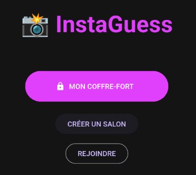

# 📸 InstaGuess - v1.3.0

**InstaGuess** est une application mobile de divertissement social développée avec **Flutter** et **Firebase**. Le concept est simple : défiez vos amis dans un jeu de devinettes basé sur vos Reels Instagram préférés.



---

## 🎮 Le Concept
Chaque joueur prépare son "Coffre-fort" de Reels. Une fois dans un salon multi-joueurs, l'application mélange les vidéos de tous les participants. À chaque vidéo diffusée, vous devez deviner : **À qui appartient ce Reel ?**

---

## ✨ Fonctionnalités (v1.3.0)

* **🎥 Lecteur MP4 Natif** : Plus de WebView ! Les vidéos sont converties via API pour une lecture fluide, sans publicité et sans besoin de connexion Instagram pour les joueurs.
* **📂 Multi-Coffres (Dossiers)** : Organisez vos pépites par thématiques (Humour, Sport, Cuisine) et choisissez quel dossier jouer lors de la création du salon.
* **🏠 Système de Salons (Lobby)** : Créez ou rejoignez une partie avec un code unique à 4 lettres.
* **⚡ Synchronisation en Temps Réel** : Grâce à Firestore, tous les joueurs voient la même vidéo et votent simultanément.
* **🧹 Nettoyage Automatique** : Gestion intelligente de la base de données Firestore (suppression des salons vides ou terminés).
* **🏆 Classement Final** : Un podium automatique désigne le vainqueur à la fin de la playlist.

---

## 🛠️ Stack Technique

* **Framework** : [Flutter](https://flutter.dev/) (Dart)
* **Backend** : [Firebase](https://firebase.google.com/)
    * **Firestore** : Gestion des salons, des joueurs, des scores et de la playlist officielle.
* **API Vidéo** : Intégration via **RapidAPI** (Instagram Video Downloader) pour l'extraction des flux `.mp4`.
* **Lecteur Vidéo** : `video_player` & `chewie` pour une interface de lecture native.
* **Stockage Local** : `shared_preferences` pour la persistance des dossiers et des liens.

---

## 🚀 Installation & Lancement

1.  **Cloner le projet** :
    ```bash
    git clone [https://github.com/MoonRProjet/instaguess.git](https://github.com/MoonRProjet/instaguess.git)
    cd instaguess
    ```

2.  **Installer les dépendances** :
    ```bash
    flutter pub get
    ```

3.  **Configuration API & Firebase** :
    * Ajoutez votre clé **RapidAPI** dans la fonction `getMp4Url()`.
    * Ajoutez votre fichier `google-services.json` dans `android/app/`.

4.  **Lancer l'application** :
    ```bash
    flutter run
    ```

---

## 📈 Évolutions à venir (Roadmap)

- [x] **Multi-Coffres** : Création de dossiers thématiques (v1.2.0).
- [x] **Lecteur MP4 Direct** : Intégration d'une API de conversion (v1.3.0).
- [ ] **Timer** : Ajouter une limite de temps de 15s pour voter.
- [ ] **Effets visuels** : Ajout de confettis et animations pour le podium final.

---

## 👤 Auteur

* **MoonRiise** - *Développeur Principal* - [@MoonRProjet](https://github.com/MoonRProjet)

---
📦 *Projet réalisé dans le cadre d'un apprentissage sur le développement mobile hybride, le streaming vidéo et le temps réel.*
